+++
author = "丁树浩"
title = "推荐算法中的序列特征模型"
date = "2022-02-08"
slug = "seq-rec-model"
description = "序列特征模型简介"
tags = [
  "推荐算法",
  "深度学习"
]
categories = [
  "RecSys"
]
image = "3.jpg"
draft = false
math = true
+++

> 在推荐领域中，行为序列特征是一种极为重要的特征。近年来，出现了很多有关行为序列特征建模的论文，研究如何将行为序列特征应用到推荐场景中，以更好挖掘用户的历史兴趣。本文将带大家梳理介绍这些论文中提出的方法。

## 序列特征

序列特征通常表现为时间上的跨度，具有很强的时间先后关系。如何在行为序列中挖掘用户兴趣的多样性以及实效性，是序列特模型研究的重点。

## 序列特征模型

按时间来看，推荐算法中的序列特征模型经历了$Pooling, Attention, RNN, Capsule, Transformer, GNN$的发展路线。基于 $Pooling$结构的模型主要包含有 $YouTube\ Rec$ , 基于$Attention$ 结构的模型主要有 $DIN,DSTN$, 基于$ RNN$ 结构的模型包含有$ GRU4Rec, DIEN, DUPN, HUP, DHAN $等，基于$Capsule$结构的模型主要包含有 $MIND, ComiRec $等，基于 $Transformer$结构的模型主要有$BST, DSIN, SIM, DMT $等，基于$GNN$结构的模型主要有 $SURGE$等。
本文将聚焦于$Pooling、attention、transformer$等结构，介绍一些主流模型的实现原理。

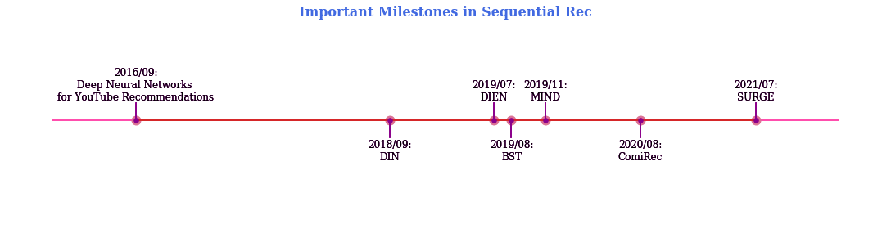

### $Pooling$结构

基于$Pooling$结构的模型通常采用 $mean, sum$ 或者$ max\ pooling$ 的方法聚合行为序列，这种结构将序列中的每一个行为看得同等重要。 $Google$便曾通过基于$pooling$ 的操作建模用户的搜索序列、观看视频序列，应用在$Youtube$的视频推荐系统的召回和排序模块中。

在召回阶段的模型如下，使用了观看视频序列、搜索序列：

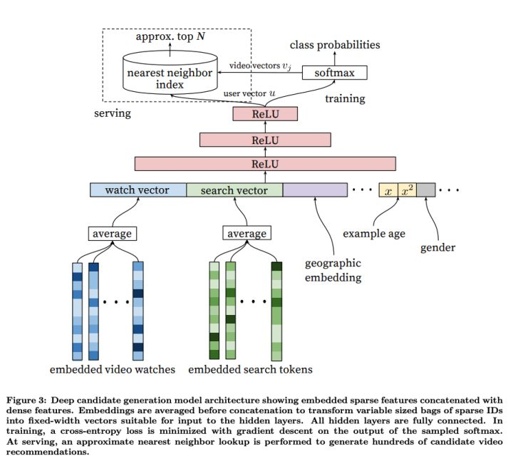

由上图可以看出，最底层的输入是用户观看过的$video$的 $embedding$ 向量，以及搜索词的$embedding$向量，特征向量里面还包括了用户的地理位置的$embedding$，年龄，性别等。然后把所有这些特征$concatenate$起来，输入到上层的$ReLU$神经网络。最后经过 $softmax$ 函数得到最后输出。

在排序阶段的模型如下所示，使用了观看视频序列:

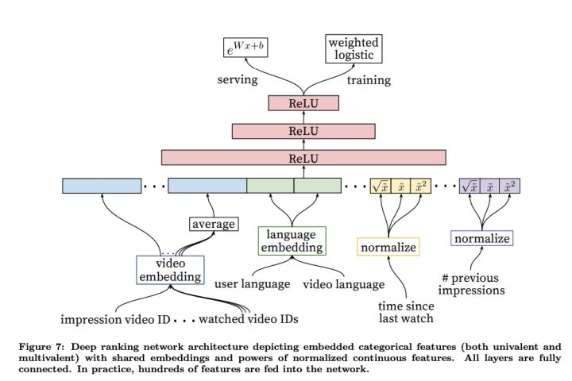

排序阶段引入另一套$DNN$作为$ranking\ model$的目的是为了引入更多描述视频、用户以及二者之间关系的特征，达到对候选视频集合准确排序的目的。

### $Attention$结构

基于$pooling$的方法中，将行为序列中的每个$Item$的重要性看作是相同的，无法区分历史行为中每个$Item$对当前待推荐$Item$的影响。对于不同的待排序物品，用户的兴趣向量也是相同的，无法建模多兴趣。

为了解决这些问题，研究者们提出了基于$Attention$结构建模行为序列的模型，主要包括 $DIN, DSTN$等。它们通过$attention$机制计算行为序列中的$Item$和待排序$Item$的$attention\ score $(即相关度)，作为序列中每个$Item$的权重，然后再将它们聚合起来。

#### $DIN$

DIN (Deep Interest Network for Click-Through Rate Prediction)由阿里妈妈的精准定向检索及基础算法团队提出。充分利用/挖掘用户历史行为数据中的信息来提高CTR预估的性能。

阿里的研究者们通过观察收集到的线上数据，发现了用户行为数据中有两个很重要的特性：
- **Diversity**：用户在浏览电商网站的过程中显示出的兴趣是十分多样性的。
- **Local activation**: 由于用户兴趣的多样性，只有部分历史数据会影响到当次推荐的物品是否被点击，而不是所有的历史记录

举个简单的例子，如图：

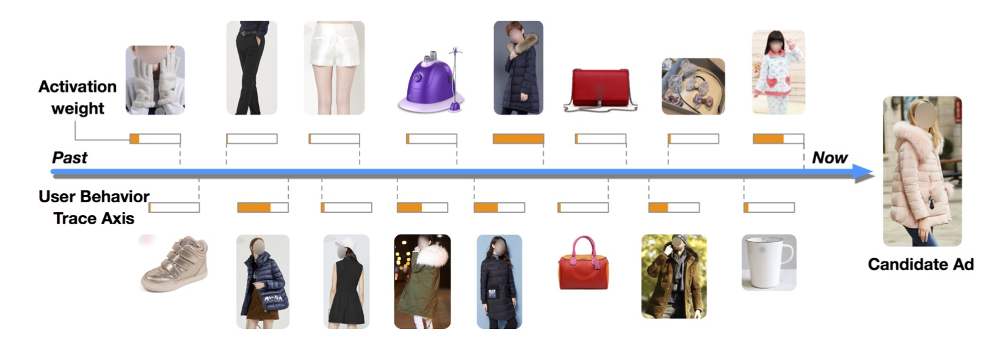

显然这是一个女生的行为历史，从最左边的手套，鞋子到右边的杯子，睡衣。现在，待推荐的候选商品是一件女式大衣。我们应该如何计算这件大衣的CTR呢？

如果按照之前的做法，我们会一碗水端平的考虑所有行为记录的影响，对应到模型中就是我们会用一个$average\ pooling$层把用户交互过的所有商品的$embedding\ vector$平均一下形成这个用户的$user\ vector$。

但是我们仔细想一想我们自己的购买过程，其实每个用户的兴趣都是多样的，女生喜欢买衣服包包，也喜欢化妆品(**Diversity**)，甚至还为自己男朋友挑选过球衣球鞋，那么你在买大衣的时候，真的要把给男朋友买球鞋的偏好考虑进来么？具体到本文的例子中，在预测大衣的$CTR$这件事情上，用户浏览过杯子，跟用户浏览过另一件大衣这两个行为的重要程度是一样的吗？显然，肯定是浏览过另一件大衣这件事对当前推荐的参考价值更高(**Local activation**)。

那么，如何体现不同的历史行为的对当前推荐的参考价值呢，答案便是$attention$机制，这也是$DIN$模型的精髓所在。

注意力机制顾名思义，就是模型在预测的时候，对用户不同行为的注意力是不一样的，“相关”的行为历史看重一些，“不相关”的历史甚至可以忽略。那么这样的思想反应到模型中也是直观的。
$$
V_{u}=f\left(V_{a}\right)=\sum_{i=1}^{N} w_{i} * V_{i}=\sum_{i=1}^{N} g\left(V_{i}, V_{a}\right) * V_{i}
$$

上式中，$V_u$是用户的$embedding$向量, $V_a$是候选广告商品的$embedding$向量，$V_i$用户$u$的第$i$次行为的$embedding$向量，因为这里用户的行为就是浏览商品或店铺，所以行为的$embedding$的向量就是那次浏览的商品或店铺的$embedding$向量。

通过注意力机制，算出不同商品对当前待推荐的商品的影响权重，有效解决了**Diversity**和**Local activation**的问题。

基于$pooling$的 base 模型如下图所示：

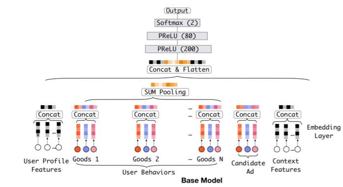

改进后的 DIN 模型如下图所示：

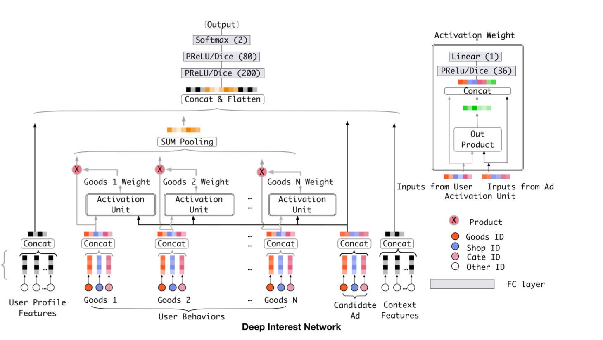

$DIN$模型中，在$pooling$之前，与$candidate$相关的商品权重大一些，与$candidate$不相关的商品权重小一些，这是一种$Attention$的思想。将$candidate$与点击序列中的每个商品发生交互来计算$attention$分数。

具体计算方法如图中右上角所示，输入包括商品和$candidate$的$embedding$向量，以及两者的外积。对于不同的$candidate$，得到的用户表示向量也不同，具有更大的灵活性。

论文中还采用了一些其他的$trick$，比较重要的有以下几点：
- 用$GAUC$这个离线metric替代$AUC$
- 用$Dice$方法替代经典的$PReLU$激活函数
- 介绍一种$Adaptive$的正则化方法

### $RNN$结构

采用$Attention$结构的模型，并没有考虑时间先后信息。按照经验，用户越新的行为，越能反应用户当时的兴趣，对于推测之后的行为所发挥的作用也越大，而旧的行为发挥的作用就弱一些，说明用户的兴趣在不断变化。

为了解决这些问题，研究者们提出了基于$RNN$建模行为序列，主要包括$DIEN, DUPN, HUP, DHAN$等。它们通过$RNN$建模行为序列的时间顺序特性，能更好地建模用户实时兴趣的变化。

#### $DIEN$

$DIEN$基于双层$RNN(GRU)$来建模用户的商品点击序列，应用在电商APP推荐广告排序中。整体结构如下:

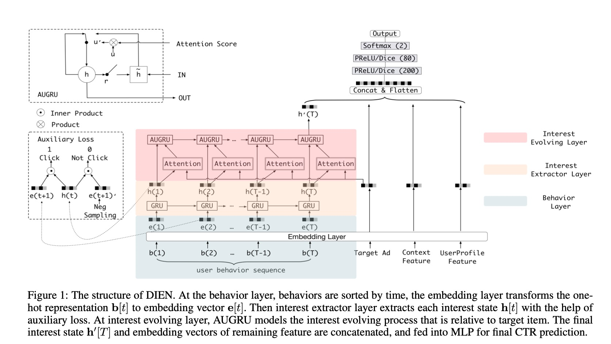

传统的$RNN$存在着两个问题：
- 在获取时序上用户兴趣表示的时候其实是将$RNN$的$hidden\ states$作为用户当前的一个$interests$，但是这个vector其实是缺少监督信息的，在计算$RNN$的$loss$时只有最后时刻的输出才会得到$target$的反应，也就是最后作为$target$的那个点击行为；
- 第二问题：我们知道RNN是用来获取不同时间行为的依赖性的，也就是说在时间序列上如果行为之间有很好的关联依赖性，那么RNN可以发挥很好的效果，但是对于用户行为来说可能在短时间内的就会有很多的点击行为，而且这些点击行为之间没有很好的依赖性，就比如我先点击一个衣服，又点击了一本书，两者之间依赖性不强，所以基于这两个问题，$DIEN$提出了两个网络结构来解决。

**$Interest\ Extractor\ Layer$**

针对第一个关于问题，$DIEN$提出了$auxiliary\ loss$，如下图所示：

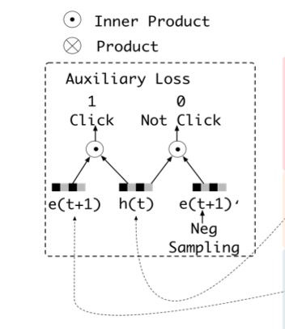

$e(t+1)$是在$t+1$时刻用户点击的item的$embedding$，$h(t)$是用户在$t$时刻$GRU$的$hidden\ stats$，$e(t+1)^{\prime}$是经过负采样的用户没有点击的$item$，这样就一目了然了，$h(t)$代表了模型预测用户在$t+1$时刻的$interests$，而$e(t+1)$则是用户在$t+1$时刻真实的$interests$，这样做一个$inner\ product$ 来计算相似度，外边再加一层$sigmoid$，就得到了$auxiliary\ loss$，公式如下：
$$
\begin{aligned}
L\_{a u x}=-& \frac{1}{N}\left(\sum\_{i=1}^{N} \sum\_{t} \log \sigma\left(\mathbf{h}\_{t}^{i}, \mathbf{e}\_{b}^{i}[t+1]\right)\right.
\left.+\log \left(1-\sigma\left(\mathbf{h}\_{t}^{i}, \hat{\mathbf{e}}\_{b}^{i}[t+1]\right)\right)\right)
\end{aligned}
$$
然后模型的$total\ loss$就变成了$target\ loss + auxiliary\ loss$:
$$
L=L_{\text {target }}+\alpha * L_{a u x}
$$
**$Interest\ Evolving\ Layer$**

针对第二个问题，$DEIN$网络提出了$AUGRU$的结构来解决传统的RNN时序依赖的问题:

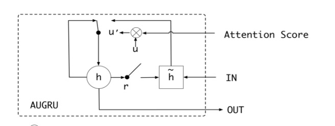
$$
\begin{aligned}
\tilde{\mathbf{u}}\_{t}^{\prime} &=a\_{t} * \mathbf{u}_{t}^{\prime} \\\
\mathbf{h}\_{t}^{\prime} &=\left(1-\tilde{\mathbf{u}}\_{t}^{\prime}\right) \circ \mathbf{h}\_{t-1}^{\prime}+\tilde{\mathbf{u}}\_{t}^{\prime} \circ \tilde{\mathbf{h}}\_{t}^{\prime}
\end{aligned}
$$

其实就是把$attention$计算的权重加了进来，整体的结构没有什么变化，但是这样其实是让时序中跟$target$不相近的$vector$给弱化掉，能够达到对于$target$兴趣进化的行为提取。

### $Transformer$结构

自从$BERT$模型在$NLP$领域大放异彩之后，$transfomer$结构似乎成为文本序列模型的标配。自然的，将$transfomer$引入到行为序列的建模中，也逐步成为工业界搜索推荐行为序列建模的主流，主要工作包括 BST, DSIN, SIM, DMT 等。

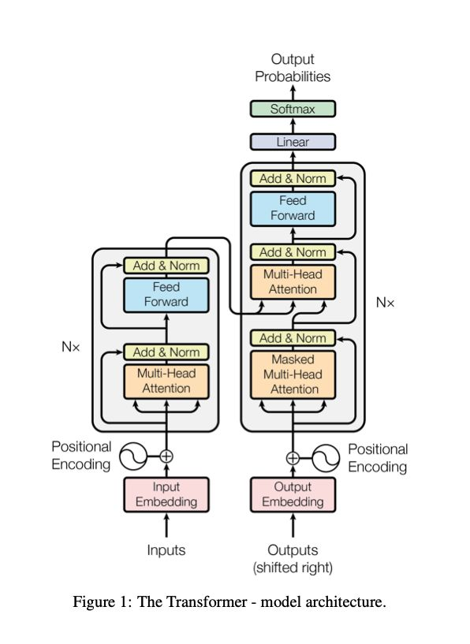

#### $BST$

$BST$ 基于$Transformer$建模行为序列，用于电商APP推荐。 BST 的模型结构主要是由 Embedding 层，Transformer 层与 MLP 层组成，如下图所示：

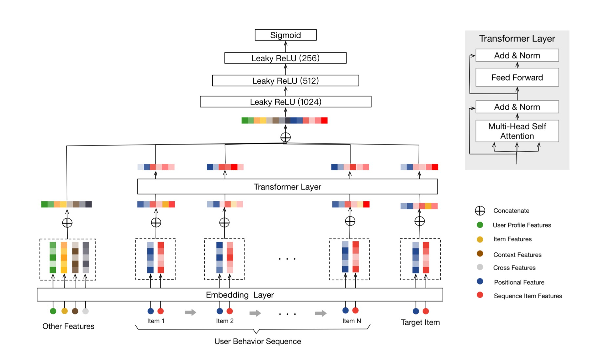

$Embedding$层主要分为 $Other\ Features, User\ Behavior\ Sequence, Target\ Item$, 

- $Other\ Features$主要包括用户的基本特征、目标物品的基本特征、上下文信息、交叉特征等，先将每个大的种类特征内的所有内容进行拼接，再分别进行embedding映射为一个低维向量，最后得到一个$embedding$矩阵。
- $User\ Behavior\ Sequence$：包含$Positional\ Feature$ 和 $Sequence\ Item\ Features$。

需要注意的是，$BST$中并没有采用$Transfomer$原始论文中所使用的正余弦位置编码方法，而是使用了相对时间差作为$position\ embedding$:
$$
\operatorname{pos}\left(v_{i}\right)=t\left(v_{t}\right)-t\left(v_{i}\right)
$$
$BST$比较直接的将 $Transformer$应用到推荐系统中，通过引入$Transformer\ Layer$来很好的利用了用户历史行为序列信息，最终在淘宝的数据集上取得了很好的效果。

### $GNN$结构

#### $SURGE$

$SURGE(SeqUential\ Recomendation\ with\ Graph neural\ nEtworks)$ 模型将图卷积应用在序列特征建模中。模型主要分为四大部分，包括兴趣图构建，兴趣融合图卷积，兴趣图池化，和预测层。

模型的框架如下图所示：

**兴趣图构建**的主要目的是将用户的交互序列转变为一个兴趣图，而用户的核心兴趣就会体现在项目节点间的相关性上，而预测下一个点击项的任何就转换为通过用户的核心兴趣来判断交互发生的可能性。

**兴趣融合卷积**的目的是通过$GNN$的思想，利用上个阶段A得到的兴趣图 ，通过图卷积操作实现相关项目节点间的信息流通（即局部范围内有差别的邻居聚合）来形成多个代表用户不同兴趣的簇集群，这一过程类似于图表示学习任务常见的节点分类。而为了减轻聚合过程中产生的噪声，作者提出两种注意力，包括簇意识注意力和搜索意识注意力。

**兴趣图池化**有点类似于卷积神经网络中的池化操作，通过学习一个集群指定矩阵，再通过矩阵相乘的到不同的兴趣集群表示，然后利用图中每个节点的重要性分数，得到全局图表示。

**预测层**对于上一阶段得到的兴趣图进行位置平整的到精简版的兴趣序列，利用 $AUGRU$输出用户层的表示，最后将用户表示，兴趣图表示以及下一个需要预测的项目表示进行级联(concat) 后接 MLP 层，得到最后 CTR 预估的结果。

## 总结

序列特征是一种很强的反应用户历史兴趣的特征，因此，如何有效的对其进行表征，是推荐模型中的重要一环。好的序列模型将极大的提升推荐的效果。$Pooling、Attention、Transformer$等结构都是目前比较成熟的应用。此外，关于**长期序列(MIMN, SIM)**、**多行为序列(MKM-SR)** 和 **多兴趣表示(MIND,ComiRec)** 等多个角度的序列建模，都取得了不错的研究成果。

## $Reference$

1. [推荐系统中的注意力机制——阿里深度兴趣网络(DIN)](https://zhuanlan.zhihu.com/p/51623339)
1. [推荐系统 DIEN (Deep Interest Evolution Network)](https://zhuanlan.zhihu.com/p/299585179)
1. [从DIN到DIEN看阿里CTR算法的进化脉络](https://zhuanlan.zhihu.com/p/78365283)
1. [《推荐系统》系列之五：序列推荐](https://zhuanlan.zhihu.com/p/389044011)
1. [序列特征在推荐算法中的应用](https://zhuanlan.zhihu.com/p/461393899)
1. Covington, Paul, Jay Adams, and Emre Sargin. Deep neural networks for youtube recommendations
1. Zhou G, Zhu X, Song C, et al. Deep interest network for click-through rate prediction
1. Zhou, Guorui, Na Mou, Ying Fan, Qi Pi, Weijie Bian, Chang Zhou, Xiaoqiang Zhu, and Kun Gai. Deep interest evolution network for click-through rate prediction.
1. Chen Q, Zhao H, Li W, et al. Behavior sequence transformer for e-commerce recommendation in alibaba
1. Chang J, Gao C, Zheng Y, et al. Sequential Recommendation with Graph Neural Networks
1. Vaswani A, Shazeer N, Parmar N, et al. Attention is all you need

